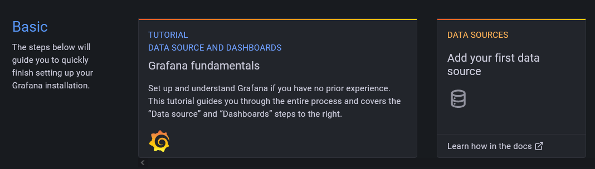
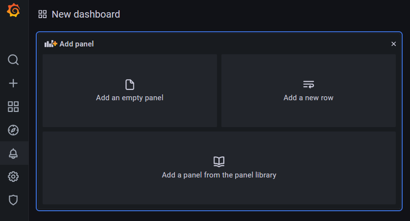
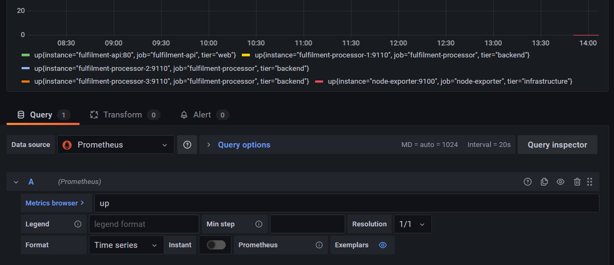
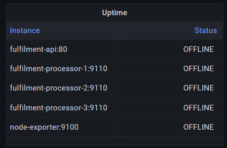
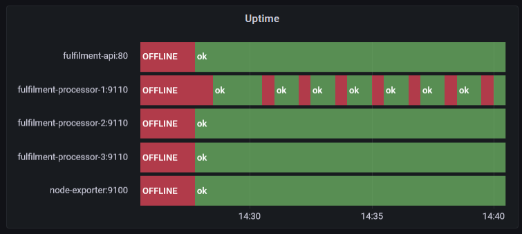
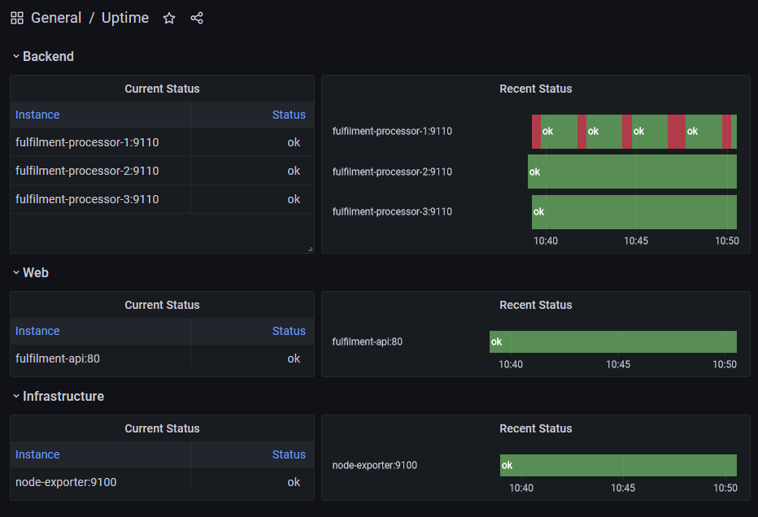

# Grafana

[Grafana](https://grafana.com/oss/grafana/) is a web-based UI for visualizing data. It can consume data from many different sources, and it's particularly well matched with Prometheus. You might use the Prometheus UI to fine-tune your queries, and then you'd take the PromQL and use it in Grafana.

## Reference

- [Using Prometheus as a data source](https://grafana.com/docs/grafana/latest/datasources/prometheus/)
- [Panels](https://grafana.com/docs/grafana/latest/panels/) - individual query visualizations
- [Dashboards](https://grafana.com/docs/grafana/latest/panels/add-a-panel/) - combining multiple panels

## Run Grafana

Grafana is a cross-platform app, written in Go. You can [download Grafana](https://grafana.com/grafana/download?pg=get&plcmt=selfmanaged-box1-cta1) for different platforms - but we'll run in a Docker container:

- [grafana.yml](./grafana.yml) - spcifies containers for Prometheus and Grafana
- [prometheus.yml](./config/prometheus.yml) - the Prometheus config we'll be using; sets up scraping for various apps, and adds the `tier` label

Run the metrics components:

```
docker-compose -f labs/grafana/grafana.yml up -d
```

> Check the Prometheus status at http://localhost:9090/targets

You'll see all the targets are down, but the `tier` label is set along with `instance` and `job`. You can add to target labels like this to include infrastructure-specific details; you might include the region for cloud services, or the operating system and CPU architecture.

> Browse to Grafana at http://localhost:3000

Sign in with the default credentials - you'll be asked to create a new password, but you can skip that step:

- username: `admin`
- password: `admin`

The homepage has a link to create a data source:



📋 Add a Prometheus data source, with the URL `http://prometheus:9090` and test it.

<details>
  <summary>Need some help?</summary>

Click the _Add data source_ panel from the homepage, or browse to http://localhost:3000/datasources/new.

- Select Prometheus as the data source type
- Enter `http://prometheus:9090` as the URL
- Leave all other fields as they are

> Click _Save & test_ and you'll see the message _Data source is working_.

</details><br/>

That's all the setup you need - now you can create a dashboard with panels to query Prometheus.

## Create an uptime panel

Click on the plus icon from the left menu and select _Create...Dashboard_. You'll see a screen like this:



Every visualization is a panel within a dashboard.

📋 Add a new panel to show the uptime of Prometheus targets using the `up` metric.

<details>
  <summary>Need some help?</summary>

Click _Add empty panel_ and enter `up` in the query panel. You'll see a preview of the visualization, which is not quite what we want:



</details><br/>

The panel designer is in three sections:

- visualization preview at the top
- data on the bottom, including the query and transforms
- display options on the right, including visualization type

The defaults are to use a _Time series_ visualization, representing a range vector from Prometheus.

Now it's time to find your way around :) 

📋 Change the panel setup so Grafana treats this as a table showing an instant vector, using a table visualization. Set up the table so the instance name and status are the only fields, showing `ok` for instances which are up and `OFFLINE` for others.

Here's what you're aiming for:



<details>
  <summary>Need some help?</summary>

In the _Query_ panel:

- set the format to Table
- check _Instant_

In the display options:

- change type to Table

In the _Transform_ panel:

- Select _Organize fields_ 
    - hide all except instance and value
    - rename value to Status

Back in display options:

- Add a title

- scroll to  _Value mappings_ and click _Edit value mappings_
    - add a mapping for value=0 to display `OFFLINE` 
    - add a mapping for value=1 to display `ok`
    - click _Apply_

Click _Apply_ at the top-right to update your panel and return to the dashboard.

</details><br/>

Grafana dashboards can be set to auto-refresh. Select to refresh every 5 seconds (top-right of the dashboard), so when we start the apps you'll see the table update as they come online.

## Visualization Types

Start the apps, so Prometheus will have some metrics to collect:

- [apps.yml](./apps.yml) - specifies the node exporter, document API and three document processors; one of the processors is configured to keep exiting and restarting.

Run the apps:

```
docker-compose -f labs/grafana/apps.yml up -d
```

> Switch back to Grafana - you'll see  the table update as instances come online.

If you watch long enough you'll see processor instance 1 flicks between `ok` and `OFFLINE`. The table we have shows the current status, and it would also be useful to see the history of each component's uptime.

Click the add panel icon in the top menu (it's the bar chart with a plus sign), and select _Add an empty panel_.

Last time we used a transform to hide labels, but we can do that in the query too:

- set the query to be `sum without(job, tier) (up)`
- change the visualization type to _State timeline_
- add the same value mapping to show 0 as `OFFLINE` and 1 as `ok`
- change the time range to (e.g.) last 15 minutes

We're getting there, just some tidying up to do.

📋 Edit the query and display options so the legend on the y-axis is more useful, hide the x-axis legend, and show `OFFLINE` as a red bar and `ok` as green.

This is the goal:



<details>
  <summary>Need some help?</summary>

In the display options:

- add a panel title

- scroll to  _Legend_
    - set _Legend mode_ to _Hidden_

- scroll to  _Thresholds_ 
    - set the base value to the colour red
    - set the next threshold to 1 and the colour green

In the query panel:

- set the legend format to `{{instance}}`

Click _Apply_.

</details><br/>

That's better - the dashboard now shows current and historical status for all the instances. We can see there's a recurring problem with processor 1, which isn't clear from the table alone.

## Lab

You'll have several dashboards for your apps, showing information at different levels.

For this lab we'll stick with instance uptime, but your job is to split the dashboard into multiple rows, one for each tier of the application:

- an infrastructure row with the node exporter instance
- a web row with the docunent API instance
- a backend row with the processor instances

Each row should have a current status table and an timeline for the instances in that tier, something like this:



Save your dashboard as JSON so you can load it into another Grafana instance later.

> Stuck? Try [hints](hints.md) or check the [solution](solution.md).

___
## Cleanup

Cleanup by removing all containers:

```
docker rm -f $(docker ps -aq)
```