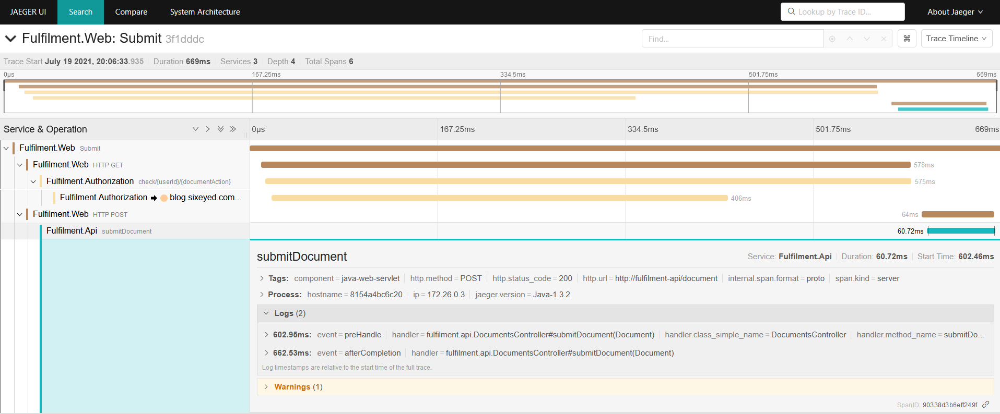

# Lab Solution

Your trace will look something like this:



This is the call stack:

- the web app receives a POST request at http://localhost:8070/Submit - this is from the user clicking the _Go_ button; there are no extra details because the information is in the request body which isn't traced

- the web app makes a GET request to the authorization service at http://fulfilment-authz/check/0421/Submit - you can guess this is checking that user with ID 0421 has permission to submit documents

- the authorization service makes a GET request to https://blog.sixeyed.com - this doesn't make any sense; in a real app this could be a call to an external identity service

- the web app makes a POST request to the document service at http://fulfilment-api/document - this is the actual request to submit a document

The final document API span contains some log entries as well as the tags. The log attributes tell you the name of the class and method:

```
handler.class_simple_name = DocumentsController	
handler.method_name	= submitDocument
```