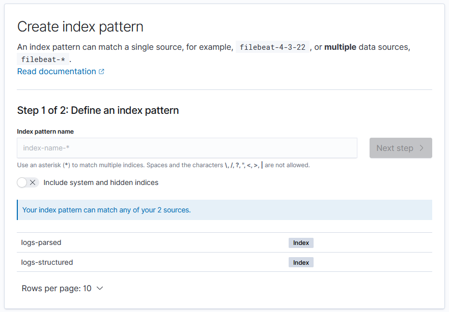
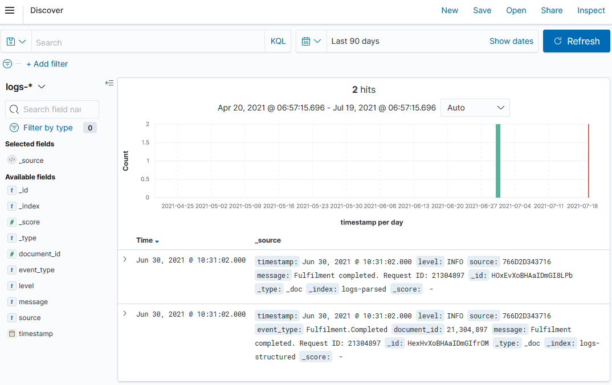
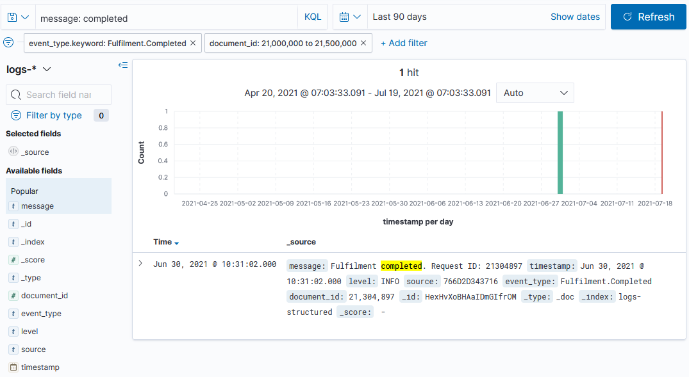

# Kibana

Kibana is the web front-end for Elasticsearch. It lets you search and filter across indices, using a simplified query language or the full DSL. 

You can save searches and build the results into visualizations. Kibana is fairly straightforward to use, and power users can build their own dashboards.

## Reference

- [Kibana Query Language (KQL)](https://www.elastic.co/guide/en/kibana/7.x/kuery-query.html) - for simple searches
- [Creating index patterns](https://www.elastic.co/guide/en/kibana/7.x/index-patterns.html) - to search across multiple indices
- [Using the Discover tab](https://www.elastic.co/guide/en/kibana/7.x/discover.html) - how you explore data in Kibana

## Run Kibana with Elasticsearch and Logstash

We'll run the full ELK stack (Elasticsearch, Logstash and Kibana) in containers:

- [compose.yml](./compose.yml) - publishes Kibana on the default port 5601, and sets up Logstash with mounts for the configuration and data directories

Start the containers and watch the Kibana logs:

```
docker-compose -f labs/kibana/compose.yml up -d

docker logs courselabs_kibana_1 -f
```

You'll see some error logs while Elasticsearch is starting, but the final log line will be something like:

```
{"type":"log","@timestamp":"2021-07-19T05:26:10Z","tags":["info","http","server","Kibana"],"pid":1,"message":"http server running at http://0.0.0.0:5601"}
```

> These are structured logs.

Kibana uses Elasticsearch to store data, so you can scale out with multiple Kibana servers and they'll all share the same data store.

Query the index list:

```
# Ctrl-C to exit the log command

curl localhost:9200/_cat/indices?v
```

You'll see a `kibana` index with some documents. Now we're ready to start using Kibana.


## Use the Kibana Console

Browse to http://localhost:5601. You'll see a welcome page with some getting started guides, and a menu to the top left. Open the menu and browse to _Dev Tools_ - that opens the [Kibana Console](http://localhost:5601/app/dev_tools#/console).

This is a much nicer way to interact with Elasticsearch - you can make requests to the API without clunky curl commands, there's auto-complete for API syntax and your previous queries are stored.

Start typing in the box on the left:

```
GET /_cat
```

> Autocomplete will help you navigate the Elasticsearch API. 

📋 Use the Console to print CAT info about the Kibana index.

<details>
  <summary>Need some help?</summary>

The `indices` endpoint can be queried for a single index:

```
GET /_cat/indices/.kibana?v
```

</details><br/>

These are just HTTP requests with a simplified syntax. You specify the HTTP verb, API path and you can include a request body in JSON.

Create some new documents - this is a parsed CSV log entry:

```
POST /logs-parsed/_doc
{ 
    "timestamp" : "2021-06-30T09:31:02Z", 
    "level" : "INFO",
    "source" : "766D2D343716",
    "message" : "Fulfilment completed. Request ID: 21304897"
}
```

> Here `logs_parsed` is the index name, and `_doc` is the endpoint to post new documents.

You'll see the usual API response, with the index name and document ID. Create another document, this time for a structured log:

```
POST /logs-structured/_doc
{ 
    "timestamp" : "2021-06-30T09:31:02Z", 
    "level" : "INFO",
    "source" : "766D2D343716",
    "event_type" : "Fulfilment.Completed",
    "document_id" : 21304897,
    "message" : "Fulfilment completed. Request ID: 21304897"
}
```

Autocomplete works within the request body too - start typing these lines, and you'll see a match query building up in DSL:

- `GET`
- `/l <tab>`
- `/_s <tab> <enter>`
- `{ <enter>`
- `q <tab> <enter>`
- `m <tab>`

Kibana helps you build a query, with templates for the values - you'll see something like this:

```
GET /logs-parsed/_search 
{
  "query": {
    "match": {
      "FIELD": "TEXT"
    }
  }
}
```

📋 Run a match query to find all the `Fulfilment.Completed` events in the structured log index.

<details>
  <summary>Need some help?</summary>

You'll build up a query like this:

```
GET /logs-structured/_search
{
  "query": {
    "match": {
      "event_type": "Fulfilment.Completed"
    }
  }
}
```

Autocomplete works for field names too, so you'll see the list of available fields for the index when you work on the query.

You'll see a single response, for the request ID 21304897.

</details><br/>

Querying data is much easier with a UI which helps you explore the data - autocomplete in the console is one part of that, but Kibana goes further with index patterns.

## Searching and filtering with Kibana

Index patterns are used to find one or more indices to search over. When you create an index pattern Kibana builds a list of fields in all the documents for the matching indices, so it can present search and filter options.

From the main menu select _Management...Stack Management_ and then click _Index Patterns_ and _Create index pattern_.

You'll see a screen like this:



> You specify a _pattern_ for the index name, so you can search across one or more indices in a single query. 

In the Logstash exercises we created data in Elasticsearch using an index for each day's logs, with the date in the index name. We could create index patterns to search across all logs for a month or for a year.

Create two index patterns:

- `logs-*` - works across documents in all the new indices
- `logs-structured` - matches just the structured logs index

For each index pattern you need to specify a _primary time field_, which Kibana uses as a filter. These indices both have a `timestamp` field you can use.

When the index pattern is created you're shown the field list - this is the
superset of all fields in all documents in all the matching indices.

Browse to the _Discover_ tab from the main menu. Your `logs-*` index pattern should be selected as the default, but there are no results. Click the calendar icon in the top right and expand the date range to include June 2021, e.g. _Last 1 year_.

You'll see both documents with a graph showing the number of documents created over time:



Time to see if Kibana really is that easy to use :)

📋 Find all the logs for completed documents. You can do this by searching or filtering.

<details>
  <summary>Need some help?</summary>

In the search box:

- `completed` will find the term across all fields
- `message: completed` will find the term in the `message` field

Or you can click _+ Add filter_:

- field `event_type`, operator `is` - you'll need to type a value
- field `event_type.keyword`, operator `is` - you can select a value, choose `Fulfilment.Completed`

</details><br/>

> Elasticsearch stores data in different types of fields, and Kibana can do more with some field types than others.

For numeric fields you can filter on a range of values. Click _+Add filter_ and select `document_id` `is between` - enter the range from start `21000000` to end `21500000`.

You can easily build up a query to find documents of a certain type, within a certain ID range, containing certain terms in the log message:




## Lab

Now we'll use Kibana for some real searching. 

Logstash is running with a pipeline to watch for CSV files and send parsed logs to Elasticsearch. Copy the `data/fulfilment-20210707.csv` file to the Logstash data directory to load it into an index:

```
cp data/fulfilment-20210707.csv labs/kibana/data/
```

Then add an index pattern in Kibana to query the new data, and use the _Discover_ tab to find out how many error logs were for request IDs greater than 30,000,000.

> Stuck? Try [hints](hints.md) or check the [solution](solution.md).

___
## Cleanup

Cleanup by removing all containers:

```
docker rm -f $(docker ps -aq)
```