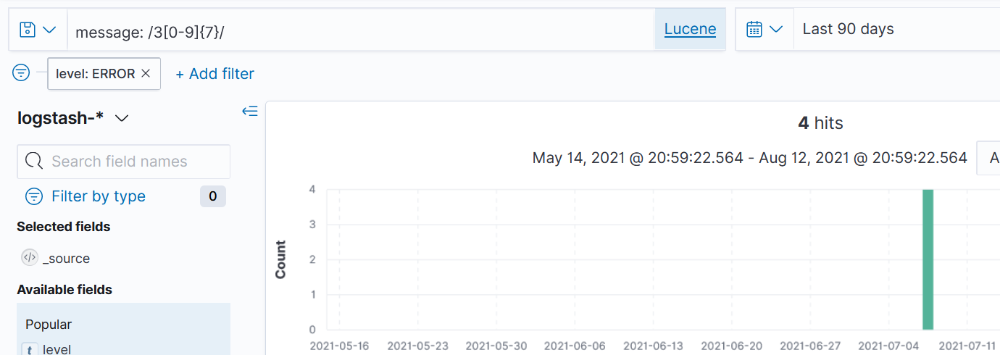

# Lab Solution

## Load the data

Copy the data file into the mounted data folder:

```
cp data/fulfilment-20210707.csv labs/kibana/data/
```

In the Kibana console, list indices:

```
GET _cat/indices?v
```

> When the log load has completed you'll see an index called `logstash-2021.07.07` with 86 documents.


Create an index pattern - you can use the exact index name, or a wildcard like `logstash-*`; use `@timestamp` as the primary time field.

## Query the index pattern

Switch to the _Discover_ tab and select your new index pattern. The search and filters from your last query are still there - remove them, ensure the timeframe is expanded to include 2021-07 and click _Update_.

Click on the `level` field from the list and you'll see the top results for that field. Click `+` on ERROR to add that value as a filter.

Now you'll have 8 hits but you can't filter any more as there isn't a numeric field containing the request ID. The best you can do is search where the message field contains the phrase "Request ID", and a wildcard beginning with "3":

```
message: "Request ID:" and message: 3*
```

> You'l see 5 hits, but only 4 are what we want:


The wildcard search finds the additional record with error code starting with 3. This data doesn't have enough structure for precise searches.

## Querying with Lucene syntax

KQL doesn't allow you to use regular expressions, but Elasticsearch is built on the [Apache Lucene](https://lucene.apache.org) search engine, and you can use Lucene searches in Kibana.

Change the search language from KQL to Lucene (by clicking the _KQL_ box next to the search box, and click the button to turn Kibana Query Language off). 

Now you can search with a regular expression which will only find numbers in the 30M range: `message: /3[0-9]{7}/`



> [Lucene syntax](https://www.elastic.co/guide/en/kibana/7.x/lucene-query.html) is a more featured query language than KQL, it can be a nice option between KQL and the full Query DSL

## More control with Query DSL

The wildcard search in KQL doesn't let you get to the right answer and you have to use a regular expression with Lucene, but you can build a query in the console which uses a simpler wildcard search:

```
GET /logstash-2021.07.07/_search?pretty&size=1
{
  "query": {
    "bool": {
      "must": {
        "wildcard": {
          "message": {
          "value": "3???????"
          }
        }
      },
      "filter": {
        "term": {
          "level.keyword": "ERROR"
        }
      }
    }
  }
}
```

That will give you the right answer because it matches only a 3 with 7 characters following it, so the 305 isn't a match. You can do a lot with Query DSL, but this is no match for properly structured data.


___
> Back to the [exercises](README.md).